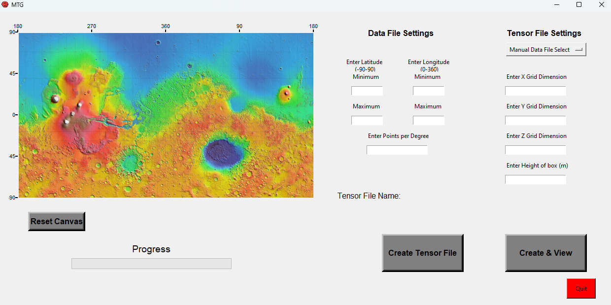
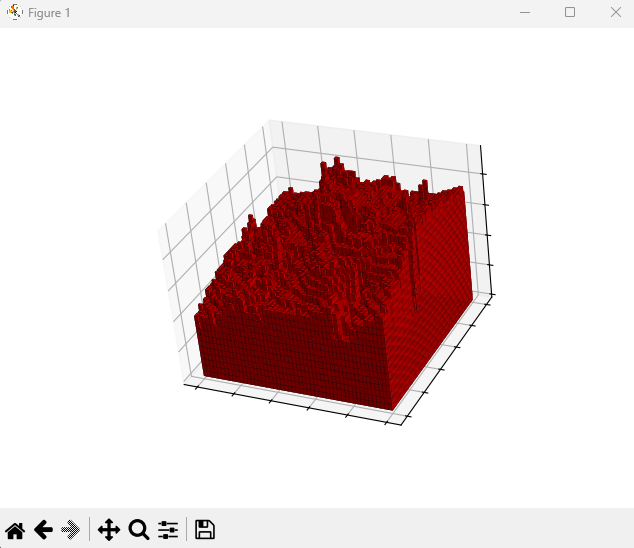

# Mars Topography Visualizer

Turns raw **Mars Orbiter Laser Altimeter (MOLA)** elevation exports into 3D occupancy
tensors for atmospheric modeling — pick a region on a map, choose a grid resolution,
get a voxel tensor.

Built as an undergraduate researcher with the University of Michigan Climate & Space
Sciences department (Aug 2024 – May 2025).

## Demo

Select a region and grid resolution from the desktop workstation:



The generator converts the selected elevation field into a 3D occupancy tensor:

<p align="center">
  
</p>

---

## What it does

MOLA gives you scattered `(longitude, latitude, elevation)` point samples. Models want a
dense, regular 3D grid. Getting from one to the other means binning points into grid
cells, filling the cells no sample landed in, and expanding the 2D height field into a 3D
occupancy volume.

## The interesting part: the rewrite

The original generator scanned **every data point for every grid cell** — an
`O(x·y·N)` triple-nested loop — then filled gaps with a Python `while` loop over the
whole array, then built the 3D tensor with another triple-nested loop.

The current version (`Martain_3D_Array.py`, 92 lines, down from 221) replaces all three:

| Stage | Before | After |
|---|---|---|
| Point → cell assignment | `for x: for y: for i in range(N)` | vectorized `np.floor` index arithmetic + boolean mask + `groupby` |
| Gap filling | Python `while 0 in array` loop | iterative `F.conv2d` on GPU with a 3×3 cross kernel that averages known neighbors, plus a max-pool nearest-neighbor fallback |
| 2D height → 3D occupancy | `for x: for y: for z:` | single broadcast comparison against the altitude axis |

The gap-fill is the piece I like most: instead of searching for nearby samples, it
convolves a cross-shaped kernel over the height field, dividing the neighbor sum by the
neighbor count to average only the cells that actually have data, and iterates until the
field is dense. Runs on GPU via PyTorch, falls back to CPU automatically.

## The tool

`Martian_GUI.py` is a Tkinter workstation that wraps the generator:

- Click a region directly on a MOLA basemap (lat/long graticule overlaid on the image)
- Set grid dimensions (x, y, z) and altitude resolution in meters
- Generation runs on a background thread, so the UI stays responsive
- Output tensors have ranged from 1,000 to 500,000 voxels across ~18 grid configurations

## Data pipeline

Five argparse CLIs for getting gigabyte-scale MOLA exports into shape:

| Script | Purpose |
|---|---|
| `split_csv.py` | Split oversized CSVs into chunks (default 4 GB) with headers preserved |
| `data_points_per_deg.py` | Bin points into lat/long degree boxes, random-sample down to N per box (seeded, reproducible) |
| `parserSearch.py` | Same binning with region filtering |
| `lat_sort.py` | Sort by latitude |
| `zipper.py` | Concatenate multiple CSVs |

## Running it

```bash
pip install numpy pandas torch
python "Martian Weather Clean 3-12-25/Martian_GUI.py"
```

Sample data is included under `Martian Weather Clean 3-12-25/dataFiles/`
(~14,900 points across 6 regional CSVs). Generated tensors are gitignored — regenerate
them from the GUI.

## Layout

```
Martian Weather Clean 3-12-25/   current version
  Martain_3D_Array.py            the vectorized generator (92 lines)
  Martian_GUI.py                 Tkinter workstation
  Martian_3D_Viewer.py           tensor viewer
  dataFiles/                     sample MOLA exports
Martain_3D_Arraycopy.py          the original 221-line generator, kept for comparison
beta-viewer/                     standalone viewer experiment
deprecated/                      earlier iterations
```
